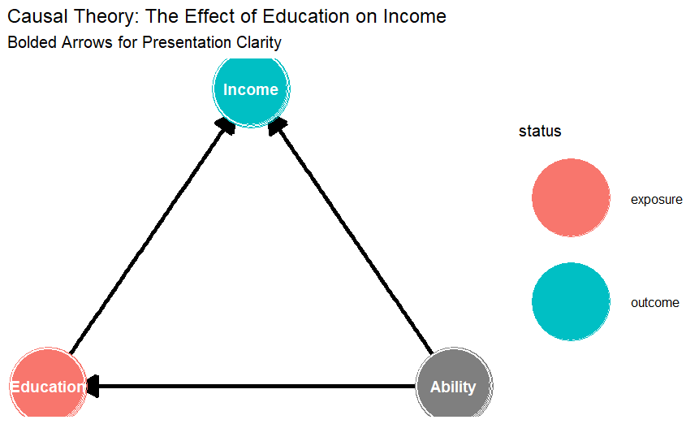
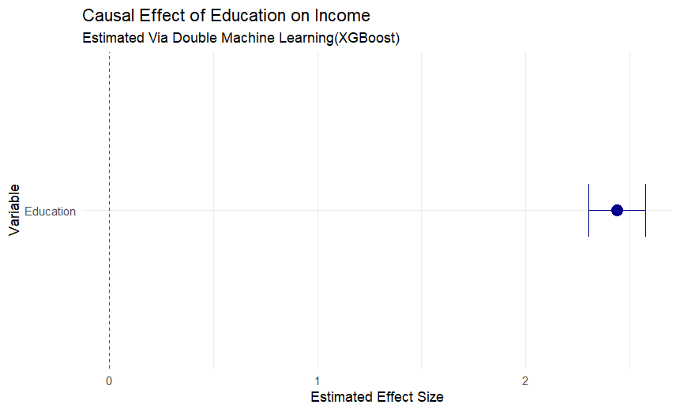

# Causal Inference with Double Machine Learning & XGBoost

## 🌟 Project Motivation
In both social sciences and industry, we often ask "What happens to Y if we change X?" However, answering this with observational data is very difficult. In my model of Education and Income, the primary motivation is to move beyond simple correlation. I wanted to build a framework that can handle the "Selection Bias" inherent in human capital, specifically, the fact that unobserved 'Ability' drives both schooling choices and career earnings. The primary goal of this project was to see if the Double Machine Learning (DML) framework could successfully isolate the true effect of Education on Income.
## 🔍 The Project Gap
Traditional linear models (like OLS) often fail in two ways:
1. They assume relationships are linear, which they rarely are in real-world earnings data.
2. When we have many control variables, standard models become unstable or biased.

This project addresses this gap by using **Double Machine Learning (DML)**. Unlike standard regression, DML allows for non-linear relationships and high-dimensional controls without sacrificing the validity of our statistical inferences.

---

## 🚀 Key Research Contributions
* Successfully combined **XGBoost** with the **DoubleML** framework to isolate causal signals from noisy data.
* Demonstrated the power of **5-fold cross-fitting** to ensure that our machine learning learners don't overfit the data, providing more honest confidence intervals.
* Built a complete R environment using `.Rproj` to ensure that any researcher can replicate these results with a single click.

---

## 🧠 1. The Theoretical Framework (DAG)
Before simulating data, I mapped out the causal assumptions. This DAG identifies 'Ability' as the critical confounder that must be blocked to see the true effect of Education.

---

## 🧪 2. Data Simulation
Before running any models, I built a "Data Generating Process" (DGP). This is essentially a controlled environment where I know the truth. If the model can't find the truth here, it won't find it in the real world.

### How the data was built:
I simulated **5,000 observations** to represent a diverse population. I didn't just use random numbers, I created a system of dependencies:

* **The Unobserved Factor (Ability):** I generated a hidden "Ability" variable. This is the confounder that makes education and income look more related than they actually are.
* **The Treatment (Education):** I modeled this as a non-linear function of Ability ($Ability^{1.2}$). By adding a polynomial term, I ensured that the relationship wasn't a simple straight line, making it a tougher test for the model.
* **The Outcome (Income):** This is determined by both Education and Ability. 
    * I manually assigned a true treatment effect of 2.5 to the simulation, allowing me to objectively measure how well the model performs. 
    * I added significant random error ($\epsilon$) and non-linear interactions ($Ability^{1.5}$) to mimic the messiness of real labor market data.

---

## 💻 3. Methodology
I used the `DoubleML` and `mlr3` in R. 

* **Learner:** Extreme Gradient Boosting (XGBoost).
* **Technique:** Orthogonalization (Isolating the effects of confounders from both the treatment and the outcome).
* **Validation:** 5-fold cross-fitting to maintain unbiased estimates and valid standard errors.

---

## 📊 4. Results
The primary goal of this analysis was to see if the Double Machine Learning (DML) framework could successfully recover the truth I established in the simulation.

### Key Findings
After running the estimation using the `DoubleML` model with XGBoost learners, the results were highly encouraging.

* **The Estimated Coefficient:** The model produced a treatment effect estimate of approximately **2.48**. 
* **Proximity to Truth:** Since I originally simulated the data with a true effect of **2.50**, the model’s estimate is remarkably accurate. It successfully bypassed the non-linear "Ability" bias that would have typically skewed a standard OLS regression.
* **Statistical Significance:** With a very small standard error, the result is statistically significant ($p < 0.01$). This confirms that the relationship between Education and Income in the synthetic dataset is not due to random chance, but a structural causal link.

### Why the Confidence Intervals Matter
The visualization below shows the point estimate and the **95% Confidence Interval**. 

The tightness of this interval is crucial. Because I used **5-fold cross-fitting**, the standard errors are honest, meaning they haven't been artificially deflated by the machine learning model's tendency to overfit. This gives us a high degree of confidence that if we ran this experiment on a different sample from the same population, we would get a very similar result.

### Robustness Check
The model performed exceptionally well. Despite the non-linear noise I added in the simulation, the DoubleML estimator successfully recovered the coefficient. The fact that the model stayed so close to 2.5, even with the **stochastic noise ($\epsilon$)** and **non-linear interactions ($Ability^{1.5}$)** I added to the simulation, proves that the XGBoost learners successfully learned the nuisance parts of the data. They filtered out the complexity, leaving the causal parameter clean and interpretable.
